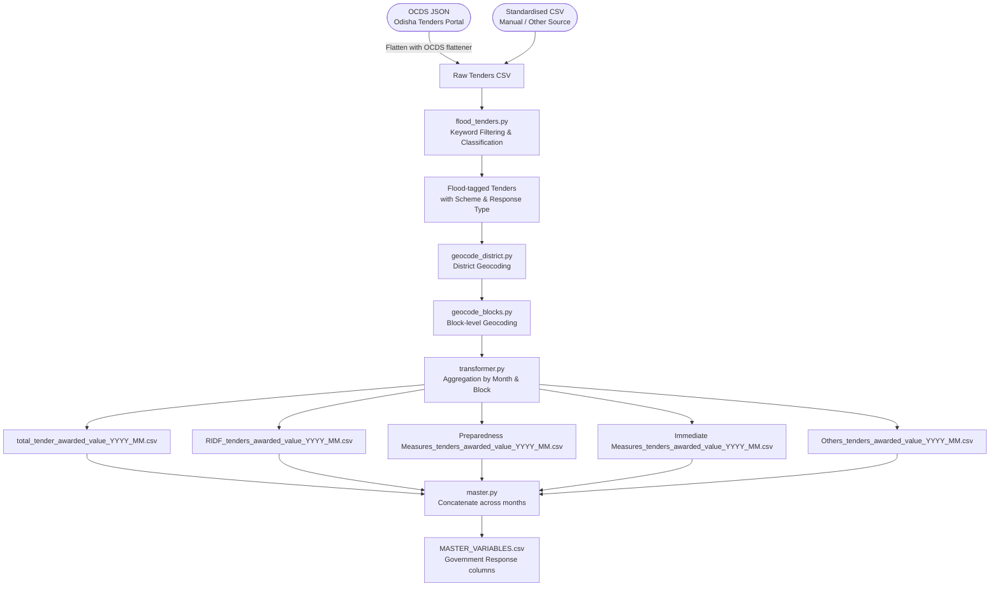

# Government Response — Data Model

**Factor Score:** Government Response
**Data Source:** Odisha Tenders Portal (OCDS / CSV)
**Scripts:** `Sources/TENDERS/scripts/`
**Temporal Coverage:** Monthly, April 2021 – November 2024
**Geographic Unit:** Block (Sub-district), Odisha

---

## Overview

This data model describes how government procurement data (tenders and awards) is processed to compute the **Government Response** factor score for the IDS-DRR risk model. The source data is procurement records from the Odisha Tenders Portal, which can be provided either in OCDS (Open Contracting Data Standard) format or as a standardised flat CSV.

The pipeline identifies flood-related tenders, classifies them by funding scheme and response type, geolocates them to administrative blocks, and aggregates awarded values by month.

---

## Data and Use Flow

---

## Data Processing Tasks

### 1. Flood Tender Identification (`flood_tenders.py`)

Tenders are tagged as flood-related using keyword matching across multiple text fields.

**Positive keywords (include):** flood, embankment, relief, erosion, SDRF, silt, dyke, culvert, inundation, riverbank, breach, desilting, water-logging, cyclone

**Negative keywords (exclude):** floodlight, pipe, covid, beautification, electricity, well, irrigation canal (non-flood context)

### 2. Classification by Season

Each tender is assigned a flood season:

| Season | Months |
|--------|--------|
| Pre-Monsoon | April – May |
| Monsoon | June – September |
| Post-Monsoon | October – March |

### 3. Classification by Funding Scheme

Scheme is identified from tender title, description, and budget source fields:

| Scheme Code | Full Name |
|-------------|-----------|
| `SDRF` | State Disaster Response Fund |
| `RIDF` | Rural Infrastructure Development Fund (NABARD) |
| `SOPD` | State Own Plan Development |
| `CIDF` | Capital Infrastructure Development Fund |
| `LTIF` | Long-Term Irrigation Fund |

### 4. Classification by Response Type

Each flood tender is classified into one of three response categories:

| Category | Description |
|----------|-------------|
| `Immediate Measures` | Emergency response tenders (e.g., relief camps, rescue, immediate repairs) |
| `Repair and Restoration` | Post-flood restoration of infrastructure |
| `Preparedness Measures` | Pre-flood works (embankment strengthening, drainage improvements) |

### 5. District Geocoding (`geocode_district.py`)

Districts are assigned using a weighted resolution logic:
1. External reference file (ground truth)
2. Tender delivery location fields
3. Procuring entity location
4. Keyword match in title/description

Conflicting district assignments are resolved by weightage; the finalised district is stored in `DISTRICT_FINALISED`.

### 6. Block Geocoding (`geocode_blocks.py`)

Tenders are mapped to block level using village names extracted from tender text, matched via sequence similarity against the Indian Village shapefile. Output stored in `BLOCK_FINALISED` with the block's `object_id`.

### 7. Aggregation (`transformer.py`)

For each month (`YYYY_MM`) and block (`object_id`):
- Sum the awarded value (`amount_awarded`) across all matched tenders
- Produce one CSV per variable (scheme or response type)

---

## Input Field Requirements

### To Classify a Tender as Flood-Related

| Field | OCDS Path | Description |
|-------|-----------|-------------|
| Tender Title | `tender.title` | Main title of the procurement |
| Tender Description | `tender.description` | Detailed description of works |
| Award Description | `awards[].description` | Description of the awarded contract |
| Item Descriptions | `tender.items[].description` | Line-item scope descriptions |
| Procurement Method Rationale | `tender.procurementMethodRationale` | Justification for procurement method |

### To Identify Award Location

| Field | OCDS Path | Description |
|-------|-----------|-------------|
| Delivery Location | `tender.items[].deliveryLocation` | Geographic delivery point |
| Delivery Address | `tender.items[].deliveryAddress` | Postal address of delivery |
| Tender ID | `tender.id` | Unique tender reference |
| Procuring Entity | `tender.procuringEntity.name` | Issuing government body |

### To Classify Response Measure Category

| Field | OCDS Path | Description |
|-------|-----------|-------------|
| Tender Title | `tender.title` | Used for keyword classification |
| Tender Description | `tender.description` | Used for keyword classification |
| Tender Classification | `tender.mainProcurementCategory` | CPV / category code |
| Award Description | `awards[].description` | Classifies awarded scope |
| Item Classification | `tender.items[].classification` | Item-level category codes |

### To Classify Budget / Funding Source

| Field | OCDS Path | Description |
|-------|-----------|-------------|
| Finance Source | `planning.budget.finance[].source` | Scheme funding source |
| Finance Party | `planning.budget.finance[].financingParty` | Funding organisation |
| Contract Finance Source | `contracts[].finance[].source` | Contract-level funding |

---

## Calculated Output Variables

| Variable Name | Description | Unit | Aggregation |
|---------------|-------------|------|-------------|
| `total_tender_awarded_value` | Total awarded value of all flood-related tenders | INR (₹) | Sum per block per month |
| `RIDF_tenders_awarded_value` | Awarded value under NABARD RIDF scheme | INR (₹) | Sum per block per month |
| `Preparedness Measures_tenders_awarded_value` | Awarded value for preparedness works | INR (₹) | Sum per block per month |
| `Immediate Measures_tenders_awarded_value` | Awarded value for emergency response works | INR (₹) | Sum per block per month |
| `Others_tenders_awarded_value` | Awarded value for other flood-related tenders | INR (₹) | Sum per block per month |

---

## Output Format

**Location:** `Sources/TENDERS/variables/[variable_name]/`

**Filename pattern:** `[variable_name]_YYYY_MM.csv`

**Example:** `total_tender_awarded_value_2022_07.csv`

| Column | Type | Description |
|--------|------|-------------|
| `object_id` | Integer | Unique block identifier (matches boundary file) |
| `timeperiod` | String | Month in `YYYY_MM` format |
| `[variable_name]` | Float | Summed awarded value in INR |

---

## Source Information

| Attribute | Value |
|-----------|-------|
| Data Provider | Odisha State Government / NIC |
| Portal | https://tendersodisha.gov.in |
| Format | OCDS JSON or flat CSV |
| Data Standard | Open Contracting Data Standard (OCDS) |
| License | Government Open Data |
| Update Frequency | Continuous (tender-by-tender) |
| Geographic Coverage | Odisha, India |
| Temporal Coverage | 2019 onwards |
