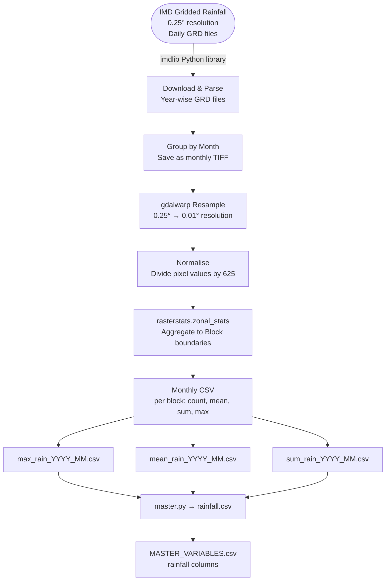

# Rainfall — Data Model

**Factor Score:** Hazard
**Data Source:** Indian Meteorological Department (IMD)
**Scripts:** `Sources/IMD/scripts/main.py`
**Temporal Coverage:** Monthly, April 2021 – November 2024
**Geographic Unit:** Block (Sub-district), Odisha

---

## Overview

This data model describes how gridded rainfall data from the Indian Meteorological Department (IMD) is downloaded, processed, and spatially aggregated to the block level to produce the **Hazard** factor inputs for the IDS-DRR risk model. IMD provides daily gridded rainfall rasters at 0.25° resolution. These are resampled, normalised, and summarised as monthly statistics per administrative block.

---

## Data and Use Flow

---

## Data Processing Tasks

### 1. Data Download

IMD gridded rainfall data is downloaded programmatically using the `imdlib` Python library.

- **Variable:** Rainfall (mm/day)
- **Resolution:** 0.25° × 0.25° (~27 km grid)
- **Format:** Binary GRD files (one per year)

### 2. Parse and Group by Month

Downloaded annual files are parsed and split into monthly subsets:
- Daily rainfall values are accumulated within each calendar month
- Each month's raster is saved as a GeoTIFF (`.tif`)

### 3. Spatial Resampling

Monthly TIFFs are resampled from 0.25° to 0.01° resolution using `gdalwarp` (bilinear interpolation). This finer resolution allows more accurate alignment with the administrative block boundaries.

### 4. Normalisation

Pixel values are divided by **625** (the ratio of pixel count change from 0.25° to 0.01° resampling) to restore correct rainfall magnitude after resampling.

### 5. Zonal Statistics

`rasterstats.zonal_stats` is used to extract pixel-level statistics aggregated to each block polygon:

| Statistic | Description |
|-----------|-------------|
| `count` | Number of raster pixels within the block |
| `mean` | Mean rainfall across all pixels in the block |
| `sum` | Total (sum) rainfall across all pixels |
| `max` | Maximum pixel value within the block |

The administrative boundary used is: `Maps/od_ids-drr_shapefiles/odisha_block_final.geojson`

### 6. Missing Value Imputation

If a block has no rainfall data for a month, the value is imputed using the **block's own historical mean** across all available months. If still missing, district mean is used.

---

## Input Field Requirements

| Field | Source | Description |
|-------|--------|-------------|
| Daily Gridded Rainfall | IMD GRD file | Accumulated rainfall in mm/day on a 0.25° grid |
| Date | File metadata / imdlib | Used to group daily files into months |
| Block Boundaries | `odisha_block_final.geojson` | Polygon boundaries for spatial aggregation |

---

## Calculated Output Variables

| Variable Name | Description | Unit | Aggregation |
|---------------|-------------|------|-------------|
| `max_rain` | Maximum rainfall pixel value within the block | mm | Max per block per month |
| `mean_rain` | Mean rainfall across block pixels | mm | Mean per block per month |
| `sum_rain` | Total accumulated rainfall within the block | mm | Sum per block per month |

---

## Output Format

**Location:** `Sources/IMD/variables/`

**Filename pattern:** `YYYY_MM.csv` (single file containing all three statistics)

| Column | Type | Description |
|--------|------|-------------|
| `object_id` | Integer | Unique block identifier |
| `timeperiod` | String | Month in `YYYY_MM` format |
| `count` | Integer | Number of pixels in the block |
| `max_rain` | Float | Maximum rainfall (mm) |
| `mean_rain` | Float | Mean rainfall (mm) |
| `sum_rain` | Float | Summed rainfall (mm) |

---

## Source Information

| Attribute | Value |
|-----------|-------|
| Data Provider | India Meteorological Department (IMD), Government of India |
| Product | IMD Gridded Rainfall Dataset |
| Access Method | `imdlib` Python library |
| Format | Binary GRD (converted to GeoTIFF) |
| Original Resolution | 0.25° × 0.25° (~27 km) |
| Processed Resolution | 0.01° × 0.01° (~1 km) |
| License | IMD Data Policy (Government of India) |
| Geographic Coverage | India (subset: Odisha) |
| Temporal Coverage | 1901 onwards (daily) |
