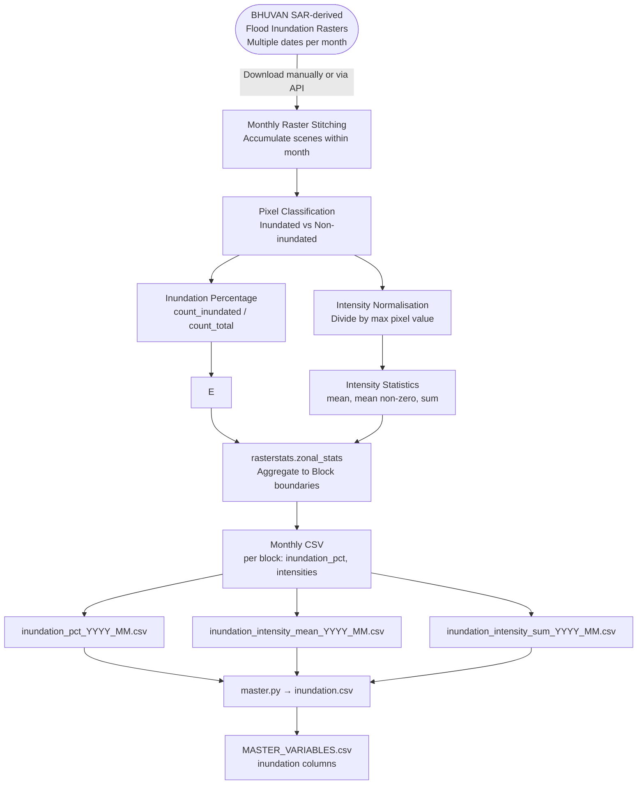

# Inundation — Data Model

**Factor Score:** Hazard
**Data Source:** BHUVAN (ISRO / SAR Satellite Imagery)
**Scripts:** `Sources/BHUVAN/scripts/transformer.py`
**Temporal Coverage:** Monthly, April 2021 – November 2024
**Geographic Unit:** Block (Sub-district), Odisha

---

## Overview

This data model describes how satellite-derived flood inundation rasters from BHUVAN (ISRO's earth observation platform) are processed to compute inundation extent and intensity per administrative block. BHUVAN provides Synthetic Aperture Radar (SAR) derived flood maps at regular intervals during monsoon seasons. Multiple scene dates within a month are stitched and aggregated to produce monthly inundation summaries.

---

## Data and Use Flow



---

## Data Processing Tasks

### 1. Raster Stitching

Multiple satellite passes may capture flood conditions on different dates within the same month. These individual scene rasters are accumulated (max-composite stitching) into a single monthly raster representing the worst observed inundation within that month.

### 2. Pixel Classification

Each raster pixel is classified as:
- **Inundated** (value > 0): pixel was covered by flood water
- **Non-inundated** (value = 0): no flood detected

Both total pixel count and inundated pixel count are tracked per block.

### 3. Inundation Percentage Calculation

For each block:

```
inundation_pct = count_inundated_pixels / count_total_pixels
```

This gives the proportion of the block's area that was under water during the month.

### 4. Intensity Normalisation

Raw pixel values represent inundation signal intensity. These are normalised by dividing by the maximum pixel value in the raster:

```
normalised_intensity = pixel_value / max(pixel_value)
```

Values range from 0 (no inundation) to 1 (maximum observed intensity).

### 5. Intensity Statistics

After normalisation, the following statistics are computed per block:

| Statistic | Description |
|-----------|-------------|
| Mean intensity | Average signal across all pixels (including zeros) |
| Mean non-zero intensity | Average signal of inundated pixels only |
| Sum intensity | Total accumulated intensity across the block |

### 6. Zonal Aggregation

`rasterstats.zonal_stats` is applied using block polygons from `odisha_block_final.geojson` to aggregate all pixel-level statistics to block level.

### 7. Missing Value Imputation

Missing monthly values for a block are filled with **0** (no inundation observed), which is the physically meaningful default for months outside the flood season.

---

## Input Field Requirements

| Field | Source | Description |
|-------|--------|-------------|
| Inundation Raster | BHUVAN GeoTIFF | SAR-derived flood map, one per scene date |
| Scene Date | File metadata / filename | Used to group scenes into months |
| Pixel Value | Raster pixel | Inundation signal intensity (raw) |
| Block Boundaries | `odisha_block_final.geojson` | Polygons for spatial aggregation |

---

## Calculated Output Variables

| Variable Name | Description | Unit | Aggregation |
|---------------|-------------|------|-------------|
| `inundation_pct` | Fraction of block area classified as inundated | Proportion (0–1) | Per block per month |
| `inundation_intensity_mean` | Mean normalised inundation intensity (all pixels) | Normalised (0–1) | Per block per month |
| `inundation_intensity_mean_nonzero` | Mean intensity of inundated pixels only | Normalised (0–1) | Per block per month |
| `inundation_intensity_sum` | Sum of normalised intensity across block pixels | Normalised sum | Per block per month |

---

## Output Format

**Location:** `Sources/BHUVAN/variables/[variable_name]/`

**Filename pattern:** `[variable_name]_YYYY_MM.csv`

**Example:** `inundation_pct_2022_07.csv`

| Column | Type | Description |
|--------|------|-------------|
| `object_id` | Integer | Unique block identifier |
| `timeperiod` | String | Month in `YYYY_MM` format |
| `count_bhuvan_pixels` | Integer | Total pixels in block |
| `count_inundated_pixels` | Integer | Pixels classified as inundated |
| `inundation_pct` | Float | Inundated fraction (0–1) |
| `inundation_intensity_mean` | Float | Mean intensity |
| `inundation_intensity_mean_nonzero` | Float | Mean intensity (non-zero pixels) |
| `inundation_intensity_sum` | Float | Sum of intensity |

---

## Source Information

| Attribute | Value |
|-----------|-------|
| Data Provider | ISRO (Indian Space Research Organisation) — BHUVAN platform |
| Product | SAR-based Flood Inundation Maps |
| Portal | https://bhuvan.nrsc.gov.in |
| Format | GeoTIFF |
| Sensor | SAR (Synthetic Aperture Radar) |
| License | ISRO Open Data Policy |
| Geographic Coverage | India (subset: Odisha) |
| Temporal Coverage | Monsoon seasons, 2020 onwards |
