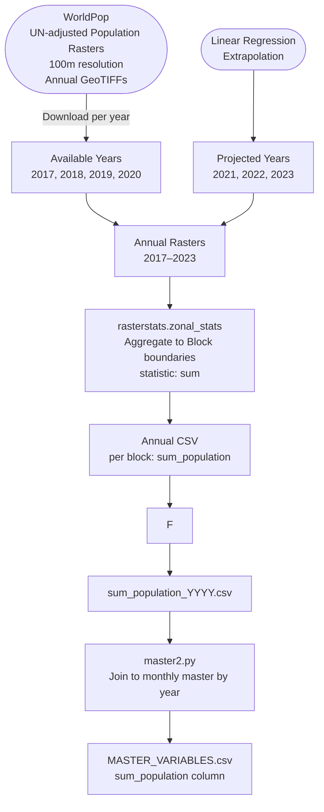

# Population (Exposure) — Data Model

**Factor Score:** Exposure
**Data Source:** WorldPop — UN-adjusted Population Rasters
**Scripts:** `Sources/WORLDPOP/scripts/zonalstats.py`
**Temporal Coverage:** Annual, 2017–2023 (projected beyond 2020)
**Geographic Unit:** Block (Sub-district), Odisha

---

## Overview

This data model describes how gridded population estimates from WorldPop are processed to compute total population per administrative block for the **Exposure** factor score in the IDS-DRR risk model. WorldPop provides UN-adjusted, 100m resolution rasters for each year. Years beyond the last published year are estimated using linear regression extrapolation. The output is an annual population count per block, subsequently joined to each month in the master time series.

---

## Data and Use Flow

---

## Data Processing Tasks

### 1. Data Download

WorldPop UN-adjusted population rasters are downloaded for each available year (2017–2020):
- **Resolution:** 100m × 100m
- **Projection:** WGS84 (EPSG:4326)
- **Format:** GeoTIFF
- **Coverage:** Country-level India raster, clipped to Odisha

### 2. Temporal Projection

WorldPop rasters are available up to 2020. Years from 2021 onwards are projected using **linear regression** fitted on the 2017–2020 pixel-level trend per block. The projected rasters are used for the 2021–2023 time period.

### 3. Zonal Statistics

`rasterstats.zonal_stats` is applied using block polygons from `odisha_block_final.geojson`:

- **Statistic used:** `sum` — total estimated population within the block boundary
- The sum of 100m pixel values within each polygon gives the block-level population estimate

### 4. Annual Join to Monthly Time Series

Since population data is annual, each year's value is broadcast to all 12 months within that year in the master dataset. The join key is `(object_id, year)`.

---

## Input Field Requirements

| Field | Source | Description |
|-------|--------|-------------|
| Population Raster | WorldPop GeoTIFF | UN-adjusted population count per 100m pixel |
| Year | Filename | Calendar year of the raster |
| Block Boundaries | `odisha_block_final.geojson` | Polygons for spatial aggregation |

---

## Calculated Output Variables

| Variable Name | Description | Unit | Aggregation |
|---------------|-------------|------|-------------|
| `sum_population` | Total estimated population within the block | Number of people | Sum of pixels per block per year |

---

## Output Format

**Location:** `Sources/WORLDPOP/variables/sum_population/`

**Filename pattern:** `sum_population_YYYY.csv`

| Column | Type | Description |
|--------|------|-------------|
| `object_id` | Integer | Unique block identifier |
| `timeperiod` | String | Year as 4-digit string (e.g., `2022`) |
| `sum_population` | Float | Total estimated population |

---

## Source Information

| Attribute | Value |
|-----------|-------|
| Data Provider | WorldPop, University of Southampton |
| Product | WorldPop UN-adjusted Population, 100m |
| Portal | https://www.worldpop.org |
| Format | GeoTIFF |
| Resolution | 100m × 100m |
| Adjustment | UN national totals disaggregated |
| License | Creative Commons Attribution 4.0 (CC BY 4.0) |
| Geographic Coverage | India (subset: Odisha) |
| Temporal Coverage | 2000–2020 (published); 2021–2023 extrapolated |
