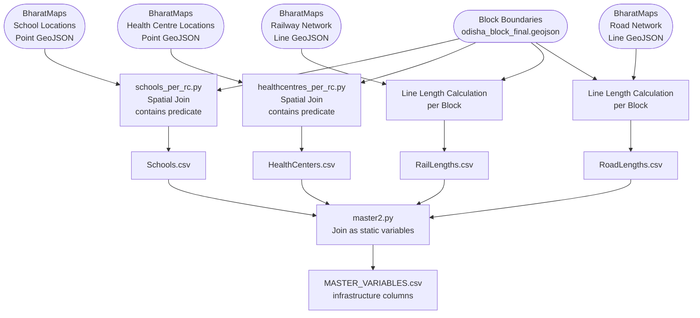

# Infrastructure (Exposure) — Data Model

**Factor Score:** Exposure
**Data Source:** BharatMaps (National Geospatial Portal, Government of India)
**Scripts:** `Sources/BHARATMAPS/scripts/schools_per_rc.py`, `healthcentres_per_rc.py`
**Temporal Coverage:** Static (one-time computation)
**Geographic Unit:** Block (Sub-district), Odisha

---

## Overview

This data model describes how infrastructure point and line datasets from BharatMaps are spatially joined to administrative block boundaries to count critical facilities and network lengths exposed to flood risk. The computed variables feed into the **Exposure** factor score in the IDS-DRR risk model. Since infrastructure locations change slowly, these are treated as static variables applied uniformly across all time periods.

---

## Data and Use Flow

---

## Data Processing Tasks

### 1. School Count (`schools_per_rc.py`)

- Load school locations as a point GeoDataFrame
- Load block polygons from `odisha_block_final.geojson`
- Perform a **spatial join** with predicate `contains`: each point is assigned to the block polygon that contains it
- Count the number of school points per block
- Output: one row per block with the count of schools

### 2. Health Centre Count (`healthcentres_per_rc.py`)

- Identical procedure to school count but applied to health centre point data
- Categories may include Primary Health Centres (PHC), Community Health Centres (CHC), sub-centres, and hospitals

### 3. Rail Length (`RailLengths`)

- Load railway network as a line GeoDataFrame
- Clip railway lines to each block polygon using `gpd.clip`
- Calculate the total length of clipped lines per block (in projected CRS for accurate km measurement)
- Output: one row per block with total rail length

### 4. Road Length (`RoadLengths`)

- Identical procedure to rail length but applied to road network data
- May include all road types (national highways, state highways, rural roads)

### 5. Static Join

Since infrastructure is static, these variables are joined to the master dataset with a dummy `year = ''` key, effectively applying the same values to all time periods.

---

## Input Field Requirements

| Dataset | Format | Key Field | Description |
|---------|--------|-----------|-------------|
| School Locations | GeoJSON (Points) | `geometry` | Point coordinates of each school |
| Health Centre Locations | GeoJSON (Points) | `geometry` | Point coordinates of each health centre |
| Railway Network | GeoJSON (Lines) | `geometry` | Polyline representing rail tracks |
| Road Network | GeoJSON (Lines) | `geometry` | Polyline representing road network |
| Block Boundaries | GeoJSON (Polygons) | `object_id` | Block polygon for spatial join |

---

## Calculated Output Variables

| Variable Name | Description | Unit | Aggregation |
|---------------|-------------|------|-------------|
| `Schools` | Count of schools within the block | Count | Spatial join (sum) per block |
| `HealthCenters` | Count of health centres within the block | Count | Spatial join (sum) per block |
| `RailLengths` | Total length of railway lines within the block | km (or metres) | Sum of clipped line lengths per block |
| `RoadLengths` | Total length of roads within the block | km (or metres) | Sum of clipped line lengths per block |

---

## Output Format

**Location:** `Sources/BHARATMAPS/variables/`

**Filename:** One static CSV per variable (no date in filename)

**Example:** `Schools.csv`

| Column | Type | Description |
|--------|------|-------------|
| `object_id` | Integer | Unique block identifier |
| `block_name` | String | Block name |
| `Schools` / `HealthCenters` / `RailLengths` / `RoadLengths` | Float / Integer | Computed metric |

---

## Source Information

| Attribute | Value |
|-----------|-------|
| Data Provider | Survey of India / National Geospatial Programme |
| Portal | https://bharatmaps.gov.in |
| Format | GeoJSON |
| License | National Map Policy, Government of India |
| Geographic Coverage | India (subset: Odisha) |
| Temporal Coverage | Static (latest available survey data) |
| Update Frequency | Periodic (survey-dependent) |
