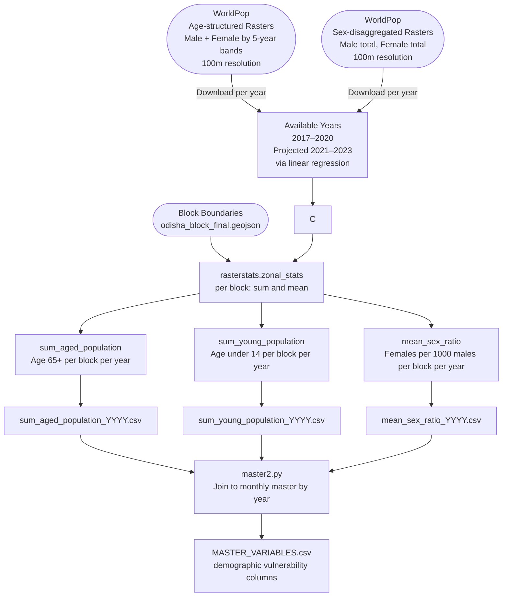

# Demographic Vulnerability — Data Model

**Factor Score:** Vulnerability
**Data Source:** WorldPop — Age-structured and Sex-disaggregated Population Rasters
**Scripts:** `Sources/WORLDPOP/scripts/zonalstats.py`
**Temporal Coverage:** Annual, 2017–2023 (projected beyond 2020)
**Geographic Unit:** Block (Sub-district), Odisha

---

## Overview

This data model describes how age-structured and sex-disaggregated population rasters from WorldPop are processed to compute demographic vulnerability indicators per administrative block. Populations with limited mobility or capacity for self-evacuation — young children, elderly, and females — face heightened flood vulnerability. These indicators feed into the **Vulnerability** factor score in the IDS-DRR risk model.

---

## Data and Use Flow

---

## Data Processing Tasks

### 1. Data Download

WorldPop provides sex-disaggregated, age-structured rasters:
- **Male/Female population** in 5-year age bands (0–4, 5–9, ..., 60–64, 65–80+)
- **Resolution:** 100m × 100m
- **Format:** GeoTIFF (one file per sex per age group per year)

### 2. Temporal Projection

Rasters are available for 2017–2020. Years 2021–2023 are projected using **linear regression** applied pixel-by-pixel (or block-by-block) on the 2017–2020 trend.

### 3. Aged Population (65+)

- Sum the male and female rasters for age bands 65–69, 70–74, 75–79, 80+
- Apply zonal statistics (`sum`) to each block polygon
- Output: `sum_aged_population` — total persons aged 65 or older per block per year

### 4. Young Population (Under 14)

- Sum the male and female rasters for age bands 0–4, 5–9, 10–14
- Apply zonal statistics (`sum`) to each block polygon
- Output: `sum_young_population` — total persons under 14 per block per year

### 5. Sex Ratio

- Load male total and female total rasters
- Calculate ratio at pixel level: `(female_pixels / male_pixels) × 1000`
- Apply zonal statistics (`mean`) to each block polygon
- Output: `mean_sex_ratio` — females per 1000 males in the block per year

### 6. Annual Join to Monthly Time Series

Annual values are broadcast to all 12 months of each year in the master dataset via a join on `(object_id, year)`.

---

## Input Field Requirements

| Field | Source | Description |
|-------|--------|-------------|
| Age-band Raster (M/F) | WorldPop GeoTIFF | Population in 5-year age band, per 100m pixel |
| Sex-total Raster (M/F) | WorldPop GeoTIFF | Total male / female population per 100m pixel |
| Year | Filename | Calendar year |
| Block Boundaries | `odisha_block_final.geojson` | Polygons for spatial aggregation |

---

## Calculated Output Variables

| Variable Name | Description | Unit | Aggregation |
|---------------|-------------|------|-------------|
| `sum_aged_population` | Total estimated population aged 65 and above | Number of people | Sum of pixels per block per year |
| `sum_young_population` | Total estimated population under 14 years | Number of people | Sum of pixels per block per year |
| `mean_sex_ratio` | Females per 1,000 males in the block | Ratio | Mean of pixel-level ratios per block per year |

---

## Output Format

**Location:** `Sources/WORLDPOP/variables/[variable_name]/`

**Filename pattern:** `[variable_name]_YYYY.csv`

| Column | Type | Description |
|--------|------|-------------|
| `object_id` | Integer | Unique block identifier |
| `timeperiod` | String | Year as 4-digit string (e.g., `2022`) |
| `sum_aged_population` / `sum_young_population` / `mean_sex_ratio` | Float | Computed demographic indicator |

---

## Source Information

| Attribute | Value |
|-----------|-------|
| Data Provider | WorldPop, University of Southampton |
| Product | WorldPop Age-structured and Sex-disaggregated Population (UN-adjusted) |
| Portal | https://www.worldpop.org |
| Format | GeoTIFF |
| Resolution | 100m × 100m |
| License | Creative Commons Attribution 4.0 (CC BY 4.0) |
| Geographic Coverage | India (subset: Odisha) |
| Temporal Coverage | 2000–2020 (published); 2021–2023 extrapolated |
