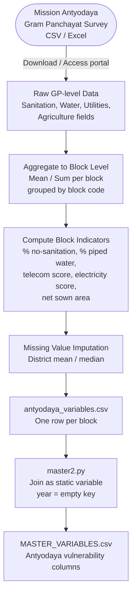

# Socioeconomic Vulnerability — Data Model

**Factor Score:** Vulnerability
**Data Source:** Mission Antyodaya Census
**Scripts:** `Sources/ANTYODAYA/` (static CSV processing)
**Temporal Coverage:** Static (Census-based, one-time)
**Geographic Unit:** Block (Sub-district), Odisha

---

## Overview

This data model describes how socioeconomic indicators from the Mission Antyodaya survey are used to compute vulnerability variables per administrative block. Mission Antyodaya is a Government of India programme that conducts annual gram panchayat-level surveys on basic amenities, services, and livelihoods. Aggregated block-level indicators reflect the capacity of a community to cope with, respond to, and recover from flood events. These feed into the **Vulnerability** factor score in the IDS-DRR risk model.

Since Antyodaya data reflects structural socioeconomic conditions that change slowly, these variables are treated as **static** inputs applied uniformly across all time periods in the model.

---

## Data and Use Flow

---

## Data Processing Tasks

### 1. Data Acquisition

Mission Antyodaya survey data is obtained from the official portal. Data is structured at the **gram panchayat (GP)** level and includes counts and percentages of households with access to various amenities.

### 2. Block-level Aggregation

GP-level records are grouped to block level using the parent block code or name. The following aggregations are applied:

| Indicator | Aggregation |
|-----------|-------------|
| Households without sanitation | Mean of GP-level percentages |
| Households with piped water | Mean of GP-level percentages |
| Telecom availability | Median of GP-level scores |
| Electricity availability | Mean of GP-level scores |
| Net sown area | Sum of GP-level hectare values |

### 3. Missing Value Imputation

When a block lacks Antyodaya data:

| Variable | Imputation Strategy |
|----------|---------------------|
| `block_nosanitation_hhds_pct` | District mean |
| `block_piped_hhds_pct` | District mean |
| `avg_tele` | District median |
| `avg_electricity` | District mean |
| `net_sown_area_in_hac` | District mean |

### 4. Static Join

Variables are joined to the master time series with `year = ''`, applying the same values to every month for a given block.

---

## Input Field Requirements

| Field | Description | Required For |
|-------|-------------|--------------|
| GP / Block Code | Unique identifier for spatial matching | Aggregation |
| Households without toilet | Count or % of HHDs lacking sanitation | `block_nosanitation_hhds_pct` |
| Households with piped water | Count or % of HHDs with piped supply | `block_piped_hhds_pct` |
| Telecom availability | Score or boolean for mobile/broadband access | `avg_tele` |
| Electricity availability | Score or boolean for power access | `avg_electricity` |
| Net sown area | Agricultural land area in hectares per GP | `net_sown_area_in_hac` |

---

## Calculated Output Variables

| Variable | Description | Unit | Risk Polarity |
|----------|-------------|------|---------------|
| `block_nosanitation_hhds_pct` | % households without sanitation | % (0–100) | Higher = more vulnerable |
| `block_piped_hhds_pct` | % households with piped water | % (0–100) | Lower = more vulnerable |
| `avg_tele` | Average telecom service availability | Score (0–1) | Lower = more vulnerable |
| `avg_electricity` | Average electricity availability | Score (0–1) | Lower = more vulnerable |
| `net_sown_area_in_hac` | Net agricultural sown area in block | Hectares | Proxy for agricultural livelihood exposure |

---

## Output Format

**Location:** `Sources/ANTYODAYA/variables/`
**Filename:** `antyodaya_variables.csv` (single static file)

| Column | Type | Description |
|--------|------|-------------|
| `object_id` | Integer | Unique block identifier |
| `block_name` | String | Block name |
| `block_nosanitation_hhds_pct` | Float | % HHDs without sanitation |
| `block_piped_hhds_pct` | Float | % HHDs with piped water |
| `avg_tele` | Float | Average telecom availability (0–1) |
| `avg_electricity` | Float | Average electricity availability (0–1) |
| `net_sown_area_in_hac` | Float | Net sown area (hectares) |

---

## Source Information

| Attribute | Value |
|-----------|-------|
| Data Provider | Ministry of Rural Development, Government of India |
| Programme | Mission Antyodaya |
| Portal | https://antyodaya.nic.in |
| Format | CSV / Excel |
| Survey Unit | Gram Panchayat |
| License | Government Open Data Licence – India (GODL) |
| Geographic Coverage | Rural India (subset: Odisha) |
| Temporal Coverage | Annual survey; static snapshot used for model |
