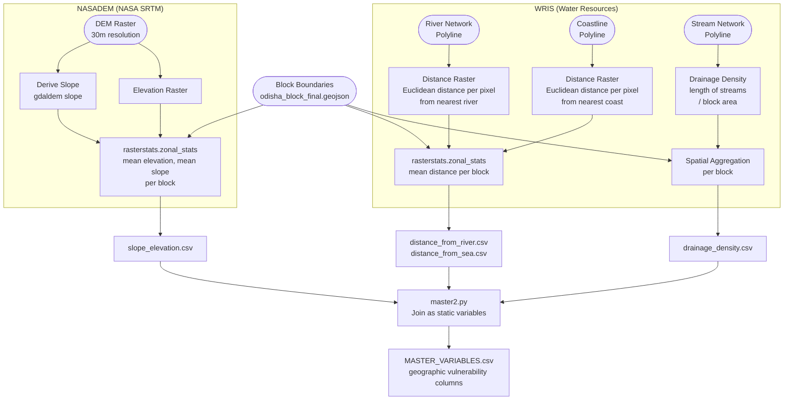

# Geographic Vulnerability — Data Model

**Factor Score:** Vulnerability
**Data Sources:** NASADEM (NASA/SRTM), WRIS (Water Resources Information System)
**Scripts:** `Sources/NASADEM/scripts/transformer.py`, `Sources/WRIS/`
**Temporal Coverage:** Static (one-time computation from static rasters)
**Geographic Unit:** Block (Sub-district), Odisha

---

## Overview

This data model describes how terrain and hydrological variables derived from NASA's SRTM digital elevation model (NASADEM) and India's Water Resources Information System (WRIS) are processed to compute geographic exposure and vulnerability indicators per administrative block. These static physical geography variables — elevation, slope, proximity to water bodies, and drainage density — condition the likelihood and severity of flooding at a location and feed into the **Vulnerability** factor score in the IDS-DRR risk model.

---

## Data and Use Flow



---

## Data Processing Tasks

### NASADEM — Elevation and Slope

#### 1. DEM Download
- **Source:** NASA SRTM via LP DAAC or NASADEM product
- **Resolution:** 30m × 30m (approximately 1 arc-second)
- **Format:** GeoTIFF tiles; merged/mosaicked to cover Odisha

#### 2. Slope Derivation
- Slope (in degrees) is derived from the DEM using `gdaldem slope`
- Output: a slope raster at the same 30m resolution

#### 3. Zonal Statistics
`rasterstats.zonal_stats` is applied to both the DEM and slope rasters using block polygons:
- **Statistic:** `mean` — average elevation and slope within each block

---

### WRIS — Hydrological Variables

#### 4. Distance from River
- River centre-lines are sourced from WRIS river network data
- A Euclidean distance raster is computed pixel-by-pixel from the nearest river segment
- Zonal statistics (`mean`) give the average distance from rivers per block

#### 5. Distance from Sea / Coast
- Coastline geometry is obtained from WRIS or administrative boundary data
- A Euclidean distance raster is computed from the nearest coastal segment
- Zonal statistics (`mean`) give the average coastal proximity per block

#### 6. Drainage Density
- The drainage density per block is calculated as:

```
drainage_density = total length of streams within block / block area (km²)
```

- Stream network polylines from WRIS are spatially clipped to each block boundary and total length summed

#### 7. Static Join

All geographic variables are joined to the master dataset with `year = ''`, applying the same values to all time periods for each block.

---

## Input Field Requirements

### NASADEM

| Field | Format | Description |
|-------|--------|-------------|
| DEM Raster | GeoTIFF (30m) | Elevation in metres above sea level |
| Block Boundaries | GeoJSON (Polygons) | Block polygons for zonal aggregation |

### WRIS

| Field | Format | Description |
|-------|--------|-------------|
| River Network | GeoJSON / Shapefile (Lines) | Polylines representing river channels |
| Coastline | GeoJSON / Shapefile (Lines) | Coastal boundary polyline |
| Stream Network | GeoJSON / Shapefile (Lines) | All stream orders for drainage density |
| Block Boundaries | GeoJSON (Polygons) | Block polygons for spatial operations |

---

## Calculated Output Variables

| Variable | Description | Unit | Risk Polarity |
|----------|-------------|------|---------------|
| `elevation_mean` | Mean elevation within the block | Metres (m) | Lower = more flood-prone |
| `slope_mean` | Mean terrain slope within the block | Degrees (°) | Lower = more flood-prone |
| `distance_from_river` | Mean distance from nearest river | Metres (m) | Closer = more vulnerable |
| `distance_from_sea` | Mean distance from nearest coastline | Metres (m) | Closer = more vulnerable |
| `drainage_density` | Stream length per unit area | km / km² | Higher = faster runoff accumulation |

---

## Output Format

**Location:** `Sources/NASADEM/variables/` and `Sources/WRIS/variables/`

**Filenames:** Static CSVs (no date suffix)

| File | Contents |
|------|----------|
| `slope_elevation.csv` | `object_id`, `elevation_mean`, `slope_mean` |
| `distance_from_river.csv` | `object_id`, `distance_from_river` |
| `distance_from_sea.csv` | `object_id`, `distance_from_sea` |
| `drainage_density.csv` | `object_id`, `drainage_density` |

---

## Source Information

| Source | Provider | Format | License |
|--------|----------|--------|---------|
| NASADEM | NASA / JPL (via LP DAAC) | GeoTIFF (30m) | NASA Open Data |
| WRIS River Network | Central Water Commission, Govt. of India | GeoJSON / Shapefile | Government Open Data |
| WRIS Drainage | Central Water Commission, Govt. of India | GeoJSON / Shapefile | Government Open Data |

| Attribute | Value |
|-----------|-------|
| NASADEM Resolution | 30m × 30m (~1 arc-second) |
| NASADEM Coverage | Global |
| WRIS Coverage | India (subset: Odisha) |
| Temporal Nature | Static — derived from fixed terrain and network datasets |
