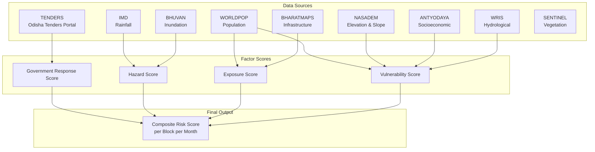

# IDS-DRR Data Model Documentation

This directory contains data model documentation for each data source that feeds into the **Intelligent Data Solution for Disaster Risk Reduction (IDS-DRR)** risk scoring framework, produced as part of DPGA (Digital Public Goods Alliance) certification.

Each document describes the data source, processing pipeline, field requirements, and computed output variables — following the same structure as the DPGA data model template.

---

## Factor Score Architecture

---

## Document Index

| # | Document | Data Source | Factor Score | Temporal Coverage |
|---|----------|-------------|--------------|-------------------|
| 1 | [Government Response](./01_government_response.md) | Odisha Tenders Portal (OCDS) | Government Response | Monthly (2021–2024) |
| 2 | [Rainfall](./02_hazard_rainfall.md) | IMD | Hazard | Monthly (2021–2024) |
| 3 | [Inundation](./03_hazard_inundation.md) | BHUVAN Satellite Imagery | Hazard | Monthly (2021–2024) |
| 4 | [Population](./04_exposure_population.md) | WorldPop | Exposure | Annual (2017–2023) |
| 5 | [Infrastructure](./05_exposure_infrastructure.md) | BharatMaps | Exposure | Static (one-time) |
| 6 | [Demographic Vulnerability](./06_vulnerability_demographics.md) | WorldPop | Vulnerability | Annual (2017–2023) |
| 7 | [Socioeconomic Vulnerability](./07_vulnerability_socioeconomic.md) | Mission Antyodaya | Vulnerability | Static (census-based) |
| 8 | [Geographic Vulnerability](./08_vulnerability_geography.md) | NASADEM + WRIS | Vulnerability | Static (one-time) |
| 8 | [Geographic Vulnerability](./08_vulnerability_geography.md) | NASADEM + WRIS | Vulnerability | Static (one-time) |

---

## Related: Risk Score Methodology Documentation

Factor score computation and TOPSIS aggregation are documented in the companion repository:
**`risk-score-model-generic/RiskScoreModel/docs/`**

| Document | Contents |
|----------|----------|
| [README.md](../../risk-score-model-generic/RiskScoreModel/docs/README.md) | Full pipeline overview and output schemas |
| [score_hazard.md](../../risk-score-model-generic/RiskScoreModel/docs/score_hazard.md) | Hazard score: log-normalise + quantile classification |
| [score_exposure.md](../../risk-score-model-generic/RiskScoreModel/docs/score_exposure.md) | Exposure score: MinMax + std-dev classification |
| [score_vulnerability.md](../../risk-score-model-generic/RiskScoreModel/docs/score_vulnerability.md) | Vulnerability score: DEA efficiency + Jenks breaks |
| [score_government_response.md](../../risk-score-model-generic/RiskScoreModel/docs/score_government_response.md) | Government Response score: FY cumsum + inverted classification |
| [topsis_risk_score.md](../../risk-score-model-generic/RiskScoreModel/docs/topsis_risk_score.md) | TOPSIS composite + district aggregation → platform output |

---

## Geographic Scope

- **Country:** India
- **State:** Odisha
- **Unit of Analysis:** Block (Sub-district) level — 479 blocks
- **Reference Boundary:** `Maps/od_ids-drr_shapefiles/odisha_block_final.geojson`
- **Key ID Column:** `object_id` (unique block identifier)

## Temporal Scope

- **Primary Time Series:** April 2021 – November 2024 (monthly)
- **Output Format:** `YYYY_MM` (e.g., `2022_07`)

## Final Integrated Output

All source variables are merged into a single master dataset:

| Column | Description |
|--------|-------------|
| `block_name` | Name of the block/sub-district |
| `object_id` | Unique geographic block identifier |
| `block_area` | Area of block in km² |
| `district` | Parent district name |
| `timeperiod` | Month in `YYYY_MM` format |
| *(factor variables)* | All 45+ computed variables from the 9 data sources |

**Script:** `Sources/master2.py`
**Output:** `RiskScoreModel/data/MASTER_VARIABLES.csv`
